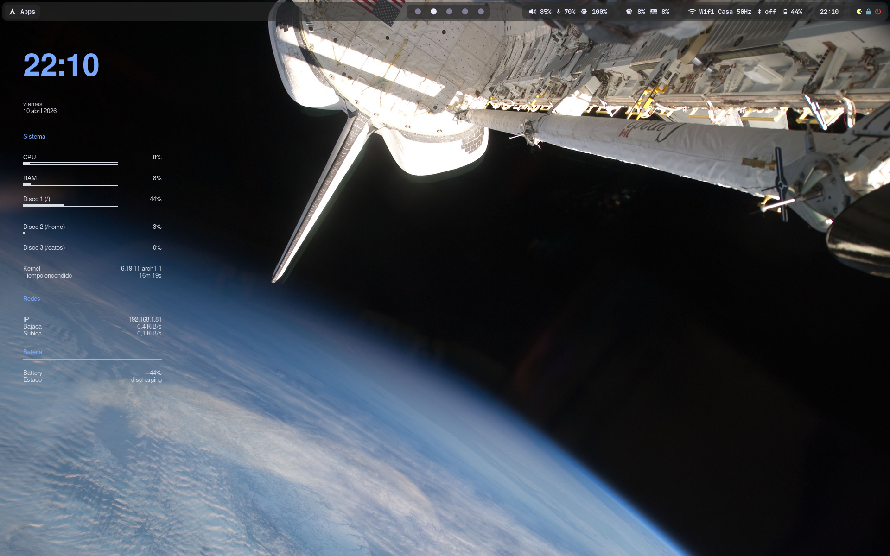
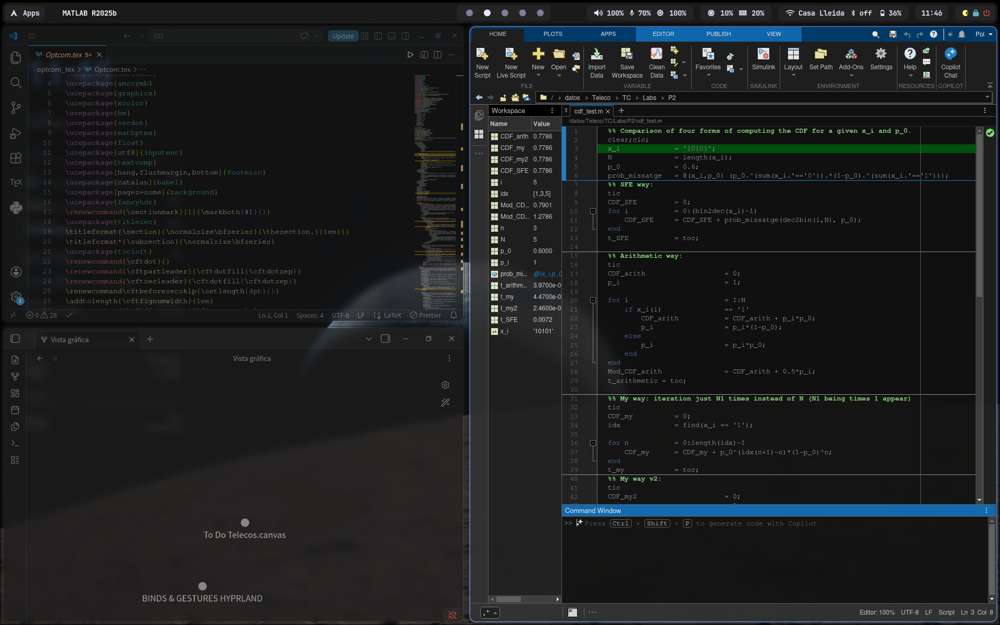
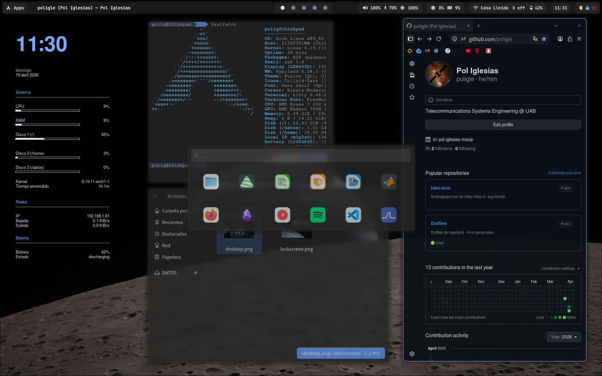
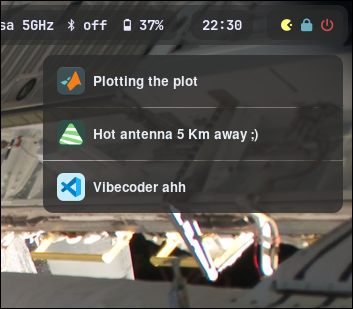

# Dotfiles (Hyprland - Arch Linux)

Configuración personal de escritorio basada en **Hyprland** sobre **Arch Linux**.

> ⚠️ Este repo refleja mi setup personal. Puede requerir ajustes según tu hardware o entorno.

---

## 🖼️ Screenshots

### Desktop


### Dwindle layout


### Wofi


### Lockscreen


### Notifications


---

## 🎨 Tema

- **GTK Theme:** Colloid-Dark
- **Icons:** Colloid-Dark
- **Cursor:** Bibata-Modern-Classic
- **Font:** Sans Serif / FreeMono (terminal)

---

## 💻 Entorno

- **WM:** Hyprland
- **Bar:** Waybar
- **Launcher:** Wofi
- **Terminal:** Kitty
- **Shell:** ZSH

---

## 📦 Qué incluye

Este repositorio contiene:

### 🖥️ Configuraciones (`.config`)

Configuraciones principales del entorno:

- Hyprland
- Waybar
- Kitty
- Wofi
- Neovim
- Dunst
- GTK (3 y 4)
- qt6ct
- xsettingsd
- Conky
- Plymouth
- ZSH

---

### ⚙️ Scripts (`scripts/`)

Scripts personalizados usados en el sistema:

- `waybar-autohide` → auto-oculta Waybar
- `feko-launch` → launcher personalizado
- `mic-led-sync` → sincronización de micrófono/LED
- `wall_next` → Cambia el wallpaper del desktop y de lockscreen

> ⚠️ Algunos scripts pueden depender de herramientas externas (ej: `playerctl`, `pactl`, etc.)

---

### 🖼️ Assets (`assets/`)

- `wallpapers/` → wallpapers usados
- `screenshots/` → capturas del entorno

---

### 📦 Paquetes (`packages/`)

- `pkglist.txt` → paquetes oficiales (pacman)
- `aur-pkglist.txt` → paquetes AUR

---

## ❌ Qué NO incluye

Este repo **no intenta replicar todo el sistema**. No incluye:

- configuraciones de aplicaciones no importantes
- caches o datos temporales
- apps como navegadores, Discord, etc.
- configuraciones específicas de hardware

---

## 🚀 Instalación

```bash
git clone https://github.com/poligle/dotfiles.git
cd dotfiles
bash install.sh
```

---

## ⚙️ Qué hace install.sh

- instala paquetes oficiales (`pacman`)
- instala paquetes AUR (`yay`)
- crea symlinks de las configuraciones en `~/.config`
- enlaza scripts en `~/.local/bin`
- enlaza wallpapers en `~/Wallpapers`
- crea backups si ya existen archivos

---

## ⚠️ Notas

- El script está pensado para **Arch Linux**
- Puede sobrescribir configuraciones existentes (se hace backup)
- Algunas cosas pueden no funcionar sin ajustes (monitores, GPU, etc.)

---

## 🧠 Objetivo del repo

Este repo está pensado como:

- Backup de configuración
- Referencia personal
- Punto de partida para otros usuarios

No como solución universal plug-and-play.

---

## 📜 Licencia

Uso personal.
